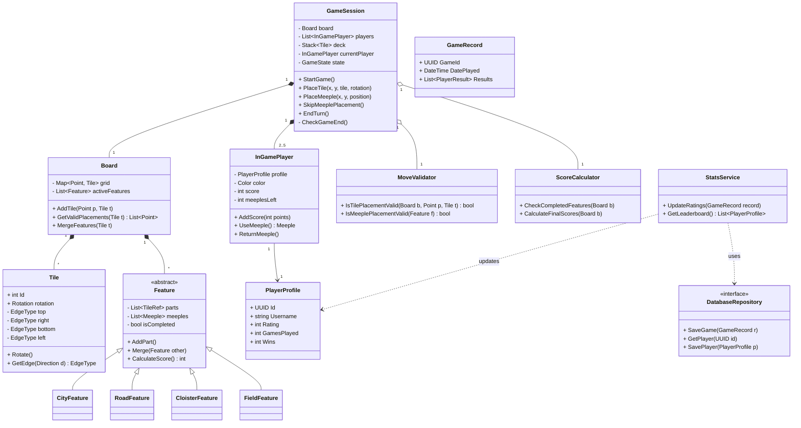

### Carcassonne assistant

```mermaid
classDiagram
    %% --- Game Core (Domain) ---
    class GameSession {
        - Board board
        - List~InGamePlayer~ players
        - Stack~Tile~ deck
        - InGamePlayer currentPlayer
        - GameState state
        + StartGame()
        + PlaceTile(x, y, tile, rotation)
        + PlaceMeeple(x, y, position)
        + SkipMeeplePlacement()
        + EndTurn()
        - CheckGameEnd()
    }

    class Board {
        - Map~Point, Tile~ grid
        - List~Feature~ activeFeatures
        + AddTile(Point p, Tile t)
        + GetValidPlacements(Tile t) List~Point~
        + MergeFeatures(Tile t)
    }

    class Tile {
        + int Id
        + Rotation rotation
        - EdgeType top
        - EdgeType right
        - EdgeType bottom
        - EdgeType left
        + Rotate()
        + GetEdge(Direction d) EdgeType
    }

    class Feature {
        <<abstract>>
        - List~TileRef~ parts
        - List~Meeple~ meeples
        - bool isCompleted
        + AddPart()
        + Merge(Feature other)
        + CalculateScore() int
    }
    
    class CityFeature { }
    class RoadFeature { }
    class CloisterFeature { }
    class FieldFeature { }

    Feature <|-- CityFeature
    Feature <|-- RoadFeature
    Feature <|-- CloisterFeature
    Feature <|-- FieldFeature

    class InGamePlayer {
        - PlayerProfile profile
        - Color color
        - int score
        - int meeplesLeft
        + AddScore(int points)
        + UseMeeple() Meeple
        + ReturnMeeple()
    }

    class MoveValidator {
        + IsTilePlacementValid(Board b, Point p, Tile t) bool
        + IsMeeplePlacementValid(Feature f) bool
    }

    class ScoreCalculator {
        + CheckCompletedFeatures(Board b)
        + CalculateFinalScores(Board b)
    }

    %% --- Data and Stats (DAL) ---
    class PlayerProfile {
        + UUID Id
        + string Username
        + int Rating
        + int GamesPlayed
        + int Wins
    }

    class GameRecord {
        + UUID GameId
        + DateTime DatePlayed
        + List~PlayerResult~ Results
    }

    class StatsService {
        + UpdateRatings(GameRecord record)
        + GetLeaderboard() List~PlayerProfile~
    }

    class DatabaseRepository {
        <<interface>>
        + SaveGame(GameRecord r)
        + GetPlayer(UUID id)
        + SavePlayer(PlayerProfile p)
    }

    %% Relationships
    GameSession "1" *-- "1" Board
    GameSession "1" *-- "2..5" InGamePlayer
    GameSession "1" o-- "1" MoveValidator
    GameSession "1" o-- "1" ScoreCalculator
    
    Board "1" *-- "*" Tile
    Board "1" *-- "*" Feature
    
    InGamePlayer "1" --> "1" PlayerProfile
    StatsService ..> DatabaseRepository : uses
    StatsService ..> PlayerProfile : updates
```
