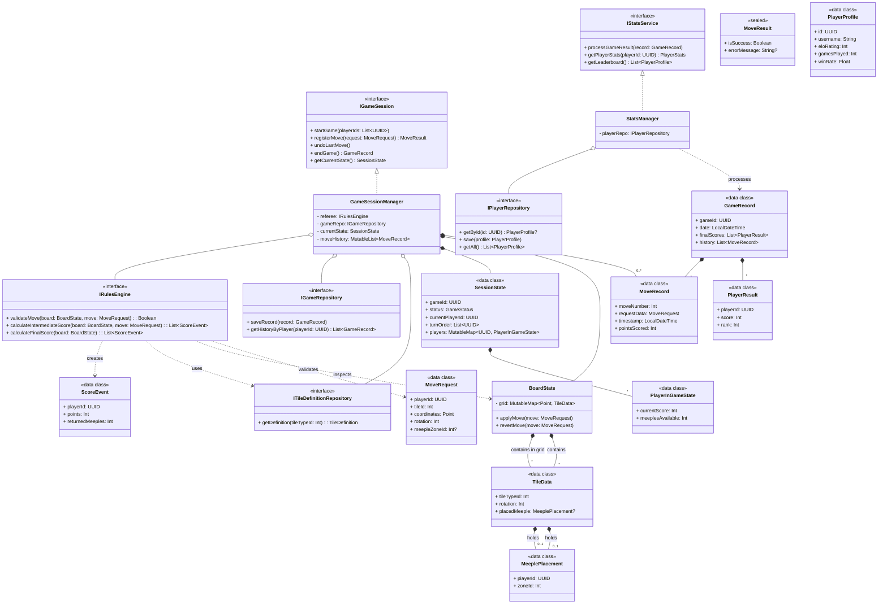

### Carcassonne assistant

```mermaid
classDiagram

    class IGameSession {
        <<interface>>
        + startGame(playerIds: List~UUID~)
        + registerMove(request: MoveRequest) MoveResult
        + undoLastMove()
        + endGame() GameRecord
        + getCurrentState() SessionState
    }

    class GameSessionManager {
        - referee: IRulesEngine
        - gameRepo: IGameRepository
        - currentState: SessionState
        - moveHistory: MutableList~MoveRecord~
    }

    class IStatsService {
        <<interface>>
        + processGameResult(record: GameRecord)
        + getPlayerStats(playerId: UUID) PlayerStats
        + getLeaderboard() List~PlayerProfile~
    }

    class StatsManager {
        - playerRepo: IPlayerRepository
    }

    class IRulesEngine {
        <<interface>>
        + validateMove(board: BoardState, move: MoveRequest): Boolean
        + calculateIntermediateScore(board: BoardState, move: MoveRequest): List~ScoreEvent~
        + calculateFinalScore(board: BoardState): List~ScoreEvent~
    }

    class ITileDefinitionRepository {
    <<interface>>
    + getDefinition(tileTypeId: Int): TileDefinition
    }
    class BoardState {
        - grid: MutableMap~Point, TileData~
        + applyMove(move: MoveRequest)
        + revertMove(move: MoveRequest)
    }
        class MoveResult {
        <<sealed>>
        + isSuccess: Boolean
        + errorMessage: String?
    }
    class PlayerResult {
    <<data class>>
    + playerId: UUID
    + score: Int
    + rank: Int
    }

    class MoveRequest {
        <<data class>>
        + playerId: UUID
        + tileId: Int
        + coordinates: Point
        + rotation: Int
        + meepleZoneId: Int? 
    }

    class MoveRecord {
        <<data class>>
        + moveNumber: Int
        + requestData: MoveRequest
        + timestamp: LocalDateTime
        + pointsScored: Int
    }

    class SessionState {
        <<data class>>
        + gameId: UUID
        + status: GameStatus
        + currentPlayerId: UUID
        + turnOrder: List~UUID~
        + players: MutableMap~UUID, PlayerInGameState~
    }

    class PlayerInGameState {
        <<data class>>
        + currentScore: Int
        + meeplesAvailable: Int
    }

    class IPlayerRepository {
        <<interface>>
        + getById(id: UUID) PlayerProfile? 
        + save(profile: PlayerProfile)
        + getAll() List~PlayerProfile~
    }

    class IGameRepository {
        <<interface>>
        + saveRecord(record: GameRecord)
        + getHistoryByPlayer(playerId: UUID) List~GameRecord~
    }

    class PlayerProfile {
        <<data class>>
        + id: UUID
        + username: String
        + eloRating: Int
        + gamesPlayed: Int
        + winRate: Float
    }

    class GameRecord {
        <<data class>>
        + gameId: UUID
        + date: LocalDateTime
        + finalScores: List~PlayerResult~
        + history: List~MoveRecord~
    }

    class TileData {
        <<data class>>
        + tileTypeId: Int
        + rotation: Int
        + placedMeeple: MeeplePlacement?
    }

    class MeeplePlacement {
        <<data class>>
        + playerId: UUID
        + zoneId: Int
    }

    class ScoreEvent {
    <<data class>>
    + playerId: UUID
    + points: Int

    + returnedMeeples: Int
    }
    
    BoardState *-- "*" TileData : contains in grid
    TileData *-- "0..1" MeeplePlacement : holds

    BoardState *-- "*" TileData : contains
    TileData *-- "0..1" MeeplePlacement : holds

    IGameSession <|.. GameSessionManager
    IStatsService <|.. StatsManager
    
    GameSessionManager o-- IRulesEngine
    GameSessionManager o-- IGameRepository
    GameSessionManager o-- ITileDefinitionRepository
    GameSessionManager *-- SessionState
    GameSessionManager *-- BoardState
    GameSessionManager *-- "0..*" MoveRecord
    
    StatsManager o-- IPlayerRepository
    StatsManager ..> GameRecord : processes
    
    IRulesEngine ..> ScoreEvent : creates
    IRulesEngine ..> ITileDefinitionRepository : uses
    
    IRulesEngine ..> BoardState : inspects
    IRulesEngine ..> MoveRequest : validates
    
    SessionState *-- "*" PlayerInGameState
    GameRecord *-- "*" MoveRecord
    GameRecord *-- "*" PlayerResult
```
